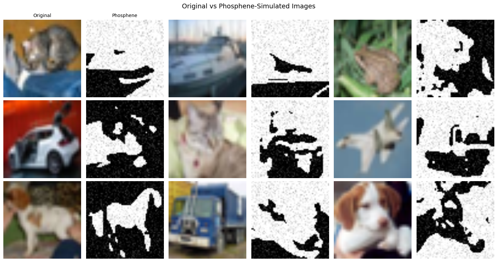
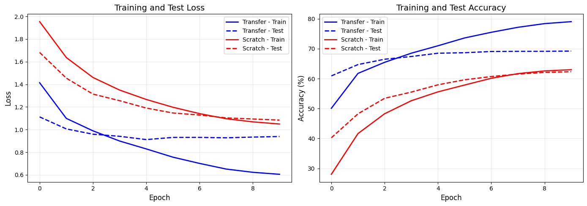
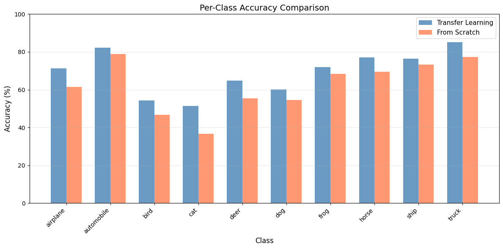

# Transfer Learning for Phosphene-Based Object Recognition in Cortical Visual Prostheses

## 🎯 Research Overview

This project investigates how transfer learning can improve object recognition for bionic eye (cortical visual prosthesis) users. We compared deep learning models trained from scratch versus those using pretrained ImageNet weights when recognizing objects through phosphene-simulated vision.

## 📊 Key Results

| Model | Test Accuracy |
|-------|--------------|
| **Transfer Learning** | **69.21%** |
| From Scratch | 62.31% |
| **Improvement** | **+6.90%** |

## 🔬 Abstract

Cortical visual prostheses (bionic eyes) restore vision by stimulating the visual cortex, but users perceive only low-resolution dots called phosphenes. This research demonstrates that transfer learning from natural images significantly improves object recognition in this challenging domain.

## 📁 Project Structure

```
├── phosphene_transfer_learning.ipynb    # Main research notebook
├── phosphene_transfer_learning_paper.pdf # Full research paper
├── README.md                           # This file
├── LICENSE                             # MIT License
└── images/                             # Visualization charts
    ├── phosphene_simulation_samples.png
    ├── per_class_accuracy_comparision.png
    └── training_test_loss_and_accuracy.png
```

## 🛠️ How to Run

### Requirements
- Python 3.8+
- PyTorch
- torchvision
- numpy
- matplotlib

### Steps
1. Clone this repository
2. Install dependencies: `pip install torch torchvision numpy matplotlib`
3. Open `phosphene_transfer_learning.ipynb` in Jupyter/Colab
4. Run all cells

## 📸 Visualizations

### Phosphene Simulation Samples


### Training Results


### Per-Class Accuracy


## 📈 Sample Results

### Per-Class Accuracy (Transfer Learning vs From Scratch)

| Class | Transfer | From Scratch | Improvement |
|-------|----------|-------------|-------------|
| airplane | 71.2% | 61.5% | +9.7% |
| automobile | 82.2% | 78.8% | +3.4% |
| bird | 54.4% | 46.8% | +7.6% |
| cat | 51.4% | 36.6% | **+14.8%** |
| deer | 64.8% | 55.4% | +9.4% |
| dog | 60.2% | 54.5% | +5.7% |
| frog | 71.9% | 68.4% | +3.5% |
| horse | 77.0% | 69.6% | +7.4% |
| ship | 76.5% | 73.2% | +3.3% |
| truck | 85.2% | 77.4% | +7.8% |

## 🔬 Methodology

1. **Phosphene Simulator**: Converts natural images to simulate bionic eye vision (blur → downsample → threshold → noise)
2. **Model**: EfficientNet-B0 (pretrained on ImageNet)
3. **Comparison**: Transfer learning vs training from scratch
4. **Dataset**: CIFAR-10 (10 object classes)

## 💡 Key Findings

1. ✅ Transfer learning outperforms training from scratch by **6.9 percentage points**
2. ✅ Pretrained ImageNet features transfer well to phosphene vision
3. ✅ Improvement is consistent across ALL object classes
4. ✅ This approach could enhance future bionic eye systems

## 🎓 About This Research

- **Author**: Abdulla Shahzan
- **Institution**: King Khalid University, Saudi Arabia
- **Date**: March 2026
- **Contact**: abdullashahzan@gmail.com

## 🔗 Related Work

- [Smart Bionic Eye - Bionic Vision Lab](https://bionicvisionlab.org/research/smart-bionic-eye/)
- [Neuralink Blindsight](https://neuralink.com/blindsight/)
- [ICVP - Illinois Tech](https://www.iit.edu/news/revolutionary-wireless-visual-prosthesis-brain-implant)

## 📝 License

MIT License - See LICENSE file for details

## 🙏 Acknowledgments

Thank you to all researchers in the visual prosthesis field whose work made this research possible.
